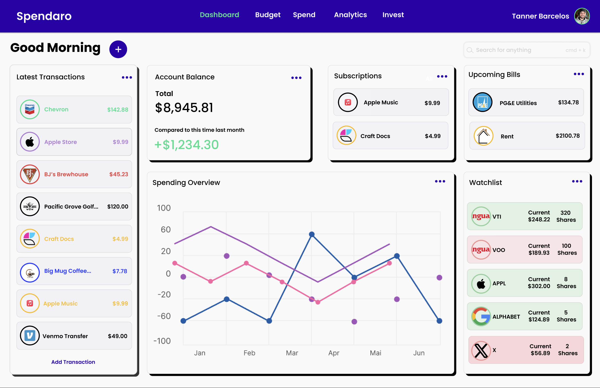

# Spendaro

## What is Spendaro?

Spendaro is a powerful finance app designed to empower families and individuals in managing their budgets, tracking expenses, and adopting the "give every dollar a job" philosophy. With its intuitive interface and comprehensive features, Spendaro is the ultimate tool for achieving financial stability and reaching your financial goals.

## Project Repositories

> The Spendaro project is divided into multiple repositories which make up a microservices architecture. Each repository is responsible for a different part of the project. The repositories are:

- [Spendaro Web UI](https://github.com/TannerBarcelos/Spendaro-Web)
- [Spendaro API](https://github.com/TannerBarcelos/Spendaro-API)
- [Spendaro Mobile App](https://github.com/TannerBarcelos/Spendaro-Mobile)
- [Spendaro Website](https://github.com/TannerBarcelos/Spendaro)

> This repository is solely for explaining the project and its parts, as well as linking to the relevant repositories.
