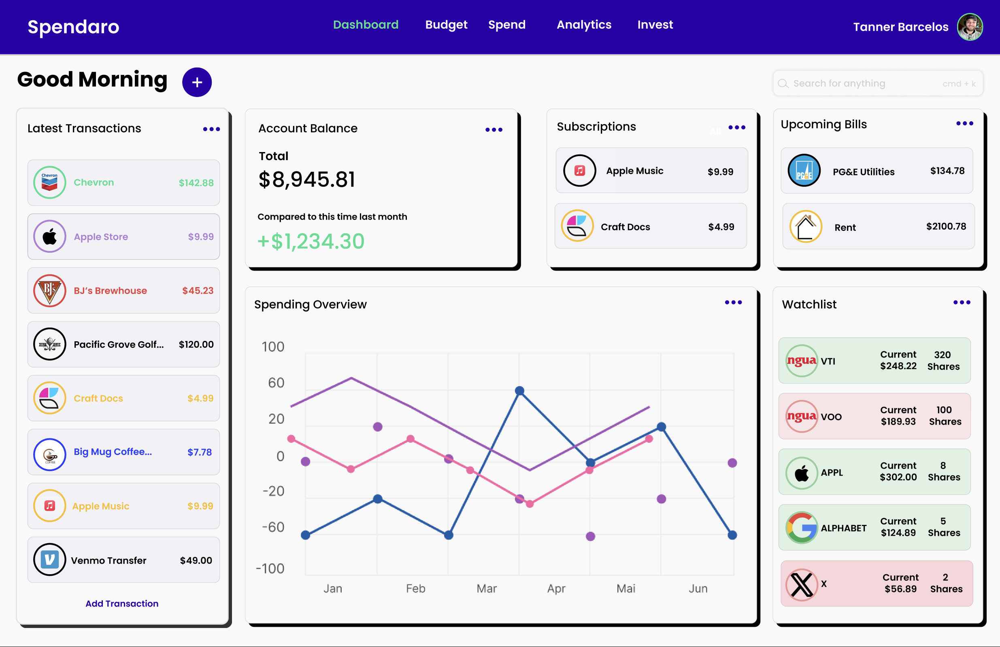

# Spendaro

**Helping make finance easier for everyone**

## About The Project

Spendaro is a personal finance application that helps you track your spending and budgeting. It is built with a modern tech stack and is designed to be easy to use. It is currently under development and is not ready for production use and a feature list is still being developed.

### Built With

- **Frontend**

  - React (with Typescript)
  - Shadcn
  - Redux Toolkit
  - Vitest
  - Cypress for E2E testing
  - Much more!

- **Backend**

  - FastAPI
  - SQLAlchemy
  - Pytest

- **Database**

  - MySQL
  - Redis

- **Infrastructure**

  - Docker
  - Kubernetes
  - AWS
  - Jenkins for CI/CD Pipelines of app
  - Github Actions for Marketing Site Deployment

- **Project Management**
  - Figma for design
  - Trello for project management
  - Much more!

## Features

Under development

## Getting Started

Please refer to the [contributing guide](./CONTRIBUTING.md) for information on how to get started with the project and how to contribute.
